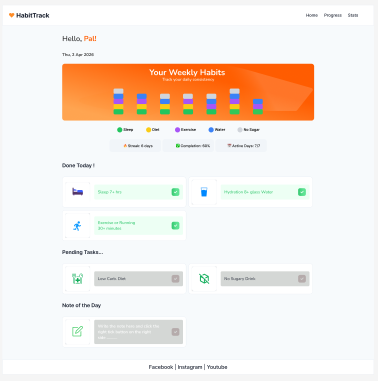
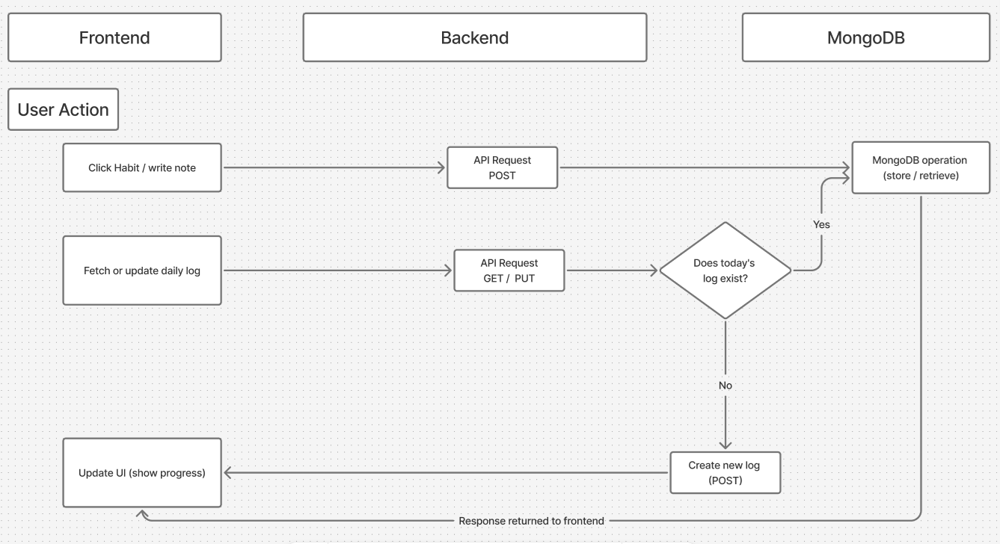
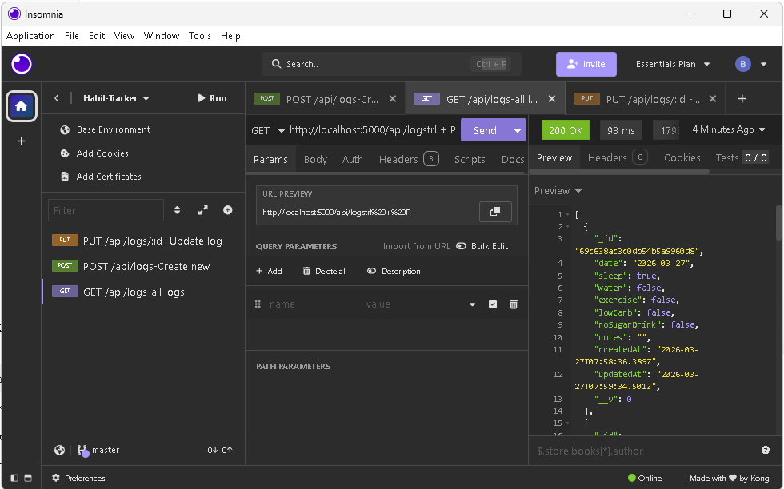

# 🧠 Arbetsprocess – Habit Tracker App

## 📌 Introduktion

Detta projekt är en fullstack-applikation där användaren kan registrera dagliga vanor, skriva anteckningar och följa sin utveckling över tid.

Applikationen är byggd med:
- React (frontend)
- Express & Node.js (backend)
- MongoDB Atlas (databas)

---

## 🗂️ Planering och arbetssätt

Projektet har genomförts med ett agilt arbetssätt.

Jag har:
- Delat upp arbetet i mindre delar (features)
- Arbetat steg för steg (frontend → backend → integration)
- Använt Git och branches (feature branches, dev)
- Testat kontinuerligt under utvecklingen

---

## 🎨 UI Design (Figma)

Innan utvecklingen började skapade jag en design i Figma för att planera layout och struktur.

Designen hjälpte mig att:
- Få en tydlig bild av gränssnittet
- Planera komponenter
- Hålla en konsekvent design

Under utvecklingen gjordes vissa justeringar jämfört med Figma-designen, eftersom verklig implementation kräver anpassningar för funktionalitet och användbarhet.

Figma-länk:  
https://www.figma.com/design/YPDnyTpbJzQ3xWfdRJZT3i/Untitled?node-id=0-1&p=f&t=cvexxZbRBqFapGss-0

---

## 🔄 Flöde (Flowchart)

Jag skapade även ett flödesschema i FigJam för att visa hur data rör sig i applikationen.

Det visar:
- Hur användaren interagerar med frontend
- Hur API-anrop skickas till backend
- Hur data sparas och hämtas från databasen

FigJam-länk:  
https://www.figma.com/board/nR3i82mXNskywbLgBevE9z/Habit-Tracker-Logics?node-id=0-1&p=f&t=VGIXItDHvurehqY6-0

---

## 🔧 Backend och API

Backend är byggd med Express och hanterar all logik.

API-endpoints:
- GET /api/logs → hämta data
- POST /api/logs → skapa ny logg
- PUT /api/logs/:id → uppdatera logg

MongoDB används för att lagra data permanent.

---

## 🧪 Testning (Insomnia)

För att säkerställa att backend fungerade korrekt testade jag alla endpoints med Insomnia.

Jag verifierade:
- Att data kan skapas (POST)
- Att data kan hämtas (GET)
- Att data kan uppdateras (PUT)

---

## ⚠️ Utmaningar

Några utmaningar under projektet:

- Att koppla frontend och backend korrekt
- Hantera MongoDB-anslutning
- Säkerställa att dagens logg skapas automatiskt
- Anpassa design från Figma till verklig implementation

---

## 💡 Reflektion och förbättringar

Jag övervägde att implementera autentisering med AWS Amplify för att skydda användardata.

Detta skulle innebära:
- Inloggning per användare
- Skydd av personlig data
- Hantering av flera användare

Jag valde att inte implementera detta i slutversionen eftersom det kräver större omstrukturering av applikationen och mer tid.

Det är dock en möjlig vidareutveckling.

---

## 🔀 Versionshantering (Git)

Under projektet har jag använt Git för versionshantering.

Jag har arbetat med:
- feature-branches för nya funktioner
- dev-branch för utveckling
- merging av färdiga funktioner till dev

Detta gjorde det enklare att arbeta strukturerat och undvika fel.

---

## 🌐 Deployment

Frontend-delen av applikationen kan deployas via Vercel.

Detta gör det möjligt att visa applikationen live, men backend (API och MongoDB) körs lokalt i denna version.

Deployment användes främst för att demonstrera gränssnittet.
## 🚀 Sammanfattning

Projektet visar:

- Fullstack-utveckling (React + Node + MongoDB)
- API-design och databashantering
- UI-design med Figma
- Logiskt tänkande via flowchart
- Testning med externa verktyg

Applikationen är fullt fungerande och kan vidareutvecklas med fler funktioner.
