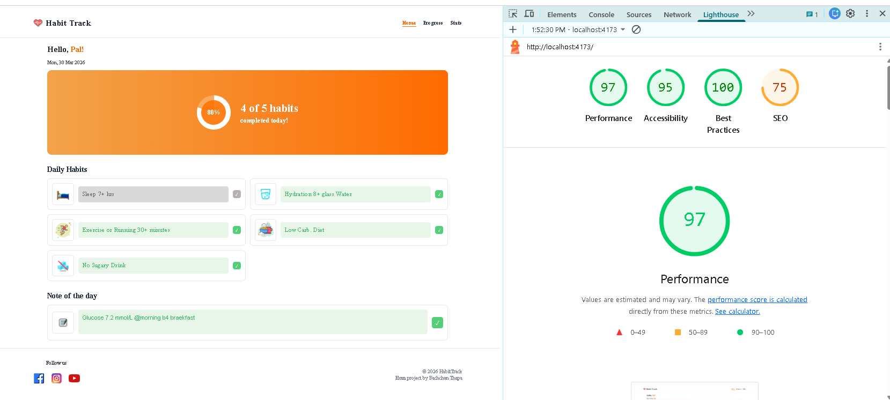
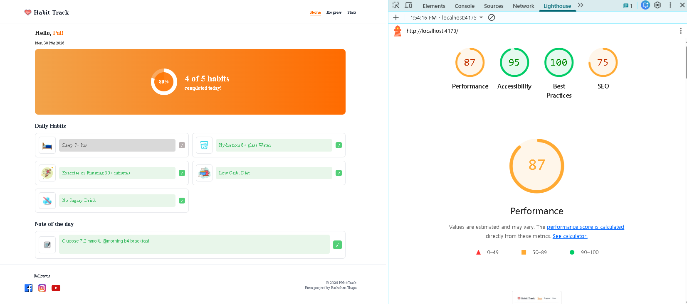

# 🧠 Arbetsprocess – Habit Tracker App

## 📌 Introduktion

Detta projekt är en fullstack-applikation där användaren kan registrera dagliga vanor, skriva anteckningar och följa sin utveckling över tid.

Applikationen är byggd med:
- React (frontend)
- Express & Node.js (backend)
- MongoDB Atlas (databas)

---

## 🗂️ Planering och arbetssätt

Projektet har genomförts med ett agilt arbetssätt.

Jag har:
- Delat upp arbetet i mindre delar (features)
- Arbetat steg för steg (frontend → backend → integration)
- Använt Git och branches (feature branches, dev)
- Testat kontinuerligt under utvecklingen

---

## 🎨 UI Design (Figma)

Innan utvecklingen började skapade jag en design i Figma för att planera layout och struktur.

Designen hjälpte mig att:
- Få en tydlig bild av gränssnittet
- Planera komponenter
- Hålla en konsekvent design

Under utvecklingen gjordes vissa justeringar jämfört med Figma-designen, eftersom verklig implementation kräver anpassningar för funktionalitet och användbarhet.

Figma-länk:  
https://www.figma.com/design/YPDnyTpbJzQ3xWfdRJZT3i/Untitled?node-id=0-1&p=f&t=cvexxZbRBqFapGss-0

---

## 🔄 Flöde (Flowchart)

Jag skapade även ett flödesschema i FigJam för att visa hur data rör sig i applikationen.

Det visar:
- Hur användaren interagerar med frontend
- Hur API-anrop skickas till backend
- Hur data sparas och hämtas från databasen

FigJam-länk:  
https://www.figma.com/board/nR3i82mXNskywbLgBevE9z/Habit-Tracker-Logics?node-id=0-1&p=f&t=VGIXItDHvurehqY6-0

---

## 🔧 Backend och API

Backend är byggd med Express och hanterar all logik.

API-endpoints:
- GET /api/logs → hämta data
- POST /api/logs → skapa ny logg
- PUT /api/logs/:id → uppdatera logg

MongoDB används för att lagra data permanent.

---

## 🧪 Testning (Insomnia)

För att säkerställa att backend fungerade korrekt testade jag alla endpoints med Insomnia.

Jag verifierade:
- Att data kan skapas (POST)
- Att data kan hämtas (GET)
- Att data kan uppdateras (PUT)

---

## ⚠️ Utmaningar

Några utmaningar under projektet:

- Att koppla frontend och backend korrekt
- Hantera MongoDB-anslutning
- Säkerställa att dagens logg skapas automatiskt
- Anpassa design från Figma till verklig implementation

---

## 💡 Reflektion och förbättringar

Jag övervägde att implementera autentisering med AWS Amplify för att skydda användardata.

Detta skulle innebära:
- Inloggning per användare
- Skydd av personlig data
- Hantering av flera användare

Jag valde att inte implementera detta i slutversionen eftersom det kräver mer tid och en större omstrukturering av applikationen.

Det är dock en möjlig vidareutveckling.

---

## 🔀 Versionshantering (Git)

Under projektet har jag använt Git för versionshantering.

Jag har arbetat med:
- feature-branches för nya funktioner
- dev-branch för utveckling
- merging av färdiga funktioner

Detta gjorde det enklare att arbeta strukturerat och undvika fel.

---

## 🌐 Deployment

Frontend-delen av applikationen är deployad via Vercel:

https://habit-tracker-sigma-gules.vercel.app

Detta gör det möjligt att visa applikationen live i webbläsaren.

Backend (Express API) är däremot inte deployad i denna version och körs lokalt tillsammans med MongoDB Atlas.

Det innebär att applikationen på Vercel endast visar gränssnittet (React), men inte kan hämta, spara eller uppdatera data.

För att få full funktionalitet krävs att backend också deployas, så att API:t kan kommunicera med databasen och göra applikationen dynamisk.

---

## 📊 Lighthouse-test

Som en del av kvalitetssäkringen testades applikationen med Lighthouse i Chrome DevTools.

För att få ett mer realistiskt resultat kördes testet i production preview-läge (`npm run build` och `npm run preview`) istället för enbart i utvecklingsläge.

### Desktop-resultat

Resultat:
- Performance: 97
- Accessibility: 95
- Best Practices: 100
- SEO: 75

### Mobil-resultat

Resultat:
- Performance: 87
- Accessibility: 95
- Best Practices: 100
- SEO: 75

Resultatet visar att applikationen har mycket god prestanda, hög tillgänglighet och följer bra tekniska standarder.

Jag valde att använda Lighthouse för att kontrollera kvaliteten och blev positivt överraskad över resultaten.

Vid vidare utveckling skulle prestanda kunna förbättras ytterligare genom till exempel:
- optimering av bilder
- lazy loading
- ytterligare SEO-förbättringar

---

## 🚀 Sammanfattning

Projektet visar:

- Fullstack-utveckling (React + Node + MongoDB)
- API-design och databashantering
- UI-design med Figma
- Logiskt tänkande via flowchart
- Testning med externa verktyg
- Prestanda- och kvalitetsanalys med Lighthouse

Applikationen är fullt fungerande och kan vidareutvecklas med fler funktioner.
